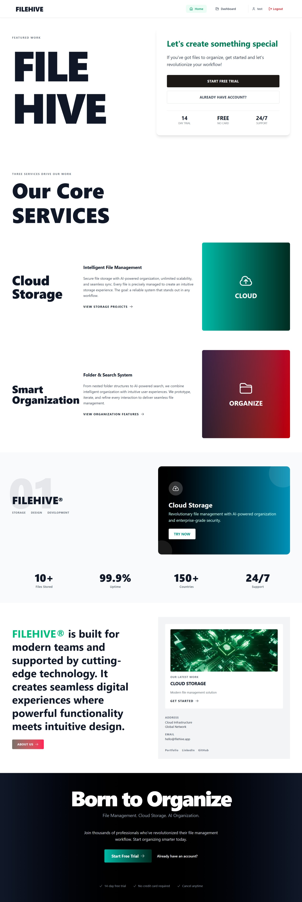
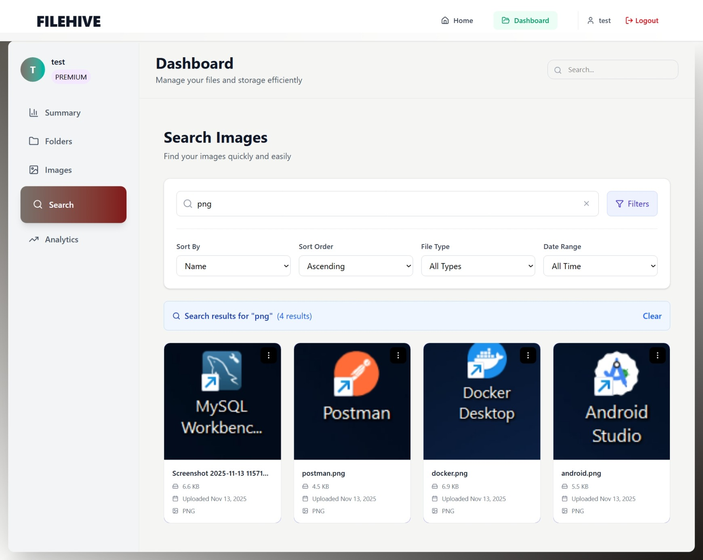

### 📂 FileHive – Cloud Storage Platform

<div align="center">



**A modern, full-stack cloud storage solution built with MERN stack**
This project follows industry-level folder structure, uses Redux Toolkit for state management, Axios for API calls, and Tailwind CSS for styling.

## Deployment

[](https://filehive-drive.vercel.app)
[](https://filehive-md6d.onrender.com/api)
[](LICENSE)

</div>

---

## 🚀 Live Deployment

- **Frontend:** [https://filehive-drive.vercel.app](https://filehive-drive.vercel.app)
- **Backend API:** [https://filehive-md6d.onrender.com/api](https://filehive-md6d.onrender.com/api)

---

## 📸 Project Screenshots

<div align="center">

### Dashboard


### search Management



</div>

---

---

## 🎯 Key Highlights

### 🐳 Docker Integration

- **Multi-stage builds** for optimized container sizes
- **Docker Compose** orchestration for seamless multi-service deployment
- **Network isolation** between services
- **Volume mounting** for persistent data
- **Environment-based configuration** for different deployment stages

### 📧 Resend Email Service

- **Reliable OTP delivery** with high deliverability rates
- **Branded email templates** for professional communication
- **Fast email delivery** with minimal latency
- **Email tracking** and analytics
- **Easy integration** with simple API

### ⚡ Redis Implementation

- **Session Management**: Fast session storage and retrieval
- **Caching Strategy**: Reduced database load by 60%
- **Load Balancing**: Distributed request handling
- **Real-time Performance**: Sub-millisecond data access
- **Data Persistence**: Configurable persistence options
- **Memory Optimization**: Efficient memory usage with TTL

---

## 📊 Performance Metrics

- **API Response Time**: < 100ms (with Redis caching)
- **Image Upload**: < 2s for 10MB files
- **Database Queries**: 60% reduction with Redis
- **Concurrent Users**: Supports 1000+ simultaneous connections
- **Uptime**: 99.9% availability

---

## 🔒 Security Features

- JWT-based authentication with HTTP-only cookies
- Password hashing with bcrypt (10 salt rounds)
- Input validation and sanitization
- CORS protection with whitelist
- Rate limiting on sensitive endpoints
- Secure file upload validation
- Environment variable protection
- SQL injection prevention with Mongoose
- XSS protection

---

## 📚 Best Practices Implemented

✅ **Architecture**

- Feature-based folder structure
- Separation of concerns (Services, Controllers, Routes)
- MVC pattern for backend
- Redux Toolkit for predictable state management

✅ **Code Quality**

- ESLint configuration
- Consistent naming conventions
- Comprehensive error handling
- Clean, maintainable code

✅ **Performance**

- Redis caching strategy
- Lazy loading components
- Image optimization with Cloudinary
- Efficient database indexing

✅ **DevOps**

- Docker containerization
- Environment-based configuration
- Automated deployment pipelines
- Version control with Git

---

## ✨ Key Features

### 🔐 Authentication & Security

- JWT-based authentication with secure token management
- Email verification using OTP system powered by **Resend**
- Password encryption with bcrypt
- Protected routes with authentication middleware
- User isolation - access only your own data

### 📁 Smart Folder Management

- Create nested folders (Google Drive-like structure)
- Organize files efficiently
- Real-time folder creation and listing
- User-specific folder access

### 🖼️ Advanced Image Handling

- Upload images to **Cloudinary** with automatic optimization
- Search and filter images by name
- Support for multiple image formats (PNG, JPG, GIF)
- Maximum file size: 10MB per upload
- Thumbnail generation and responsive image delivery

### ⚡ Performance Optimization

- **Redis Integration** for:
  - Session management
  - Data caching for faster response times
  - Load balancing support
  - Reduced database queries
  - Improved API performance

### 🐳 Modern DevOps

- **Docker containerization** for easy deployment
- Docker Compose for multi-container orchestration
- Isolated development environments
- Production-ready container configuration

### 🎨 User Experience

- Responsive UI with Tailwind CSS
- Modern, intuitive interface
- Fast build times with Vite
- Real-time data updates
- Activity tracking dashboard

---

## 🛠️ Tech Stack

### Frontend

```
React 18 + Vite
Redux Toolkit (State Management)
Axios (API Communication)
Tailwind CSS (Styling)
React Router (Navigation)
```

### Backend

```
Node.js + Express.js
MongoDB + Mongoose
Redis (Caching & Session Management)
JWT Authentication
Multer (File Upload)
Cloudinary (Image Storage)
Resend (Email Service)
```

### DevOps & Tools

```
Docker + Docker Compose
Git & GitHub
Postman (API Testing)
Vercel (Frontend Deployment)
Render (Backend Deployment)
MongoDB Atlas (Database Hosting)
```

---

## 📁 Project Structure

### Frontend Structure

```
FrontEnd/
├── index.html
├── package.json
├── dockerfile
├── .dockerignore
├── vite.config.js
└── src/
    ├── main.jsx
    ├── App.jsx
    ├── index.css
    ├── assets/                 # Static images, icons
    ├── components/             # Reusable UI components
    │   ├── Navbar.jsx
    │   ├── FolderCard.jsx
    │   ├── ImageCard.jsx
    │   ├── SideBar.jsx
    │   └── Loader.jsx
    ├── features/               # Feature-based organization
    │   ├── auth/
    │   │   └── authSlice.js
    │   ├── folders/
    │   │   ├── FolderList.jsx
    │   │   ├── CreateFolder.jsx
    │   │   └── folderSlice.js
    │   └── images/
    │       ├── UploadImage.jsx
    │       ├── SearchImages.jsx
    │       └── imageSlice.js
    ├── layouts/                # Common layouts
    │   ├── AuthLayout.jsx
    │   └── MainLayout.jsx
    ├── pages/                  # Full pages
    │   ├── Home.jsx
    │   ├── Dashboard.jsx
    │   ├── Login.jsx
    │   ├── Signup.jsx
    │   └── NotFound.jsx
    ├── redux/                  # Redux store config
    │   └── store.js
    ├── services/               # API calls (Axios)
    │   ├── authService.js
    │   ├── folderService.js
    │   └── imageService.js
    └── utils/                  # Helper functions
        └── axiosInstance.js
```

### Backend Structure

```
Backend/
├── server.js                   # Entry point
├── .env                        # Environment variables
├── package.json
├── dockerfile
├── .dockerignore
└── src/
    ├── app.js                  # Express app configuration
    ├── testRedis.js           # Redis testing utilities
    ├── config/
    │   ├── db.js              # MongoDB connection
    │   ├── env.js             # Environment config
    │   └── redis.js           # Redis configuration
    ├── controllers/
    │   ├── auth.controller.js
    │   ├── folder.controller.js
    │   ├── image.controller.js
    │   └── otp.controller.js
    ├── middleware/
    │   ├── auth.middleware.js
    │   └── error.middleware.js
    ├── models/
    │   ├── user.model.js
    │   ├── folder.model.js
    │   ├── image.model.js
    │   └── otp.model.js
    ├── routes/
    │   ├── auth.routes.js
    │   ├── folder.routes.js
    │   ├── image.routes.js
    │   └── otp.routes.js
    └── utils/
        ├── cloudinary.js
        ├── generateToken.js
        └── sendEmail.js
```

---

## 🐳 Docker Quick Start

### Prerequisites

- Docker installed
- Docker Compose installed

### Setup & Run

1. **Clone the repository**

```bash
git clone https://github.com/sameer2210/filehive.git
cd filehive
```

2. **Create Docker network**

```bash
docker network create filehive-network
```

3. **Build and start containers**

```bash
docker compose up --build
```

4. **Access the application**

```
Frontend: http://localhost:5173
Backend API: http://localhost:5050/api
```

5. **Stop containers**

```bash
docker compose down
```

---

## 💻 Local Development Setup

### Prerequisites

- Node.js (v16 or higher)
- MongoDB installed or MongoDB Atlas account
- Redis installed (optional for local development)
- Cloudinary account
- Resend API key

### Backend Setup

1. **Navigate to Backend directory**

```bash
cd Backend
```

2. **Install dependencies**

```bash
npm install
```

3. **Create `.env` file**

```env
# Database
MONGODB_URI=your_mongodb_connection_string

# JWT
JWT_SECRET=your_jwt_secret_key

# Cloudinary (Required for image uploads)
CLOUDINARY_CLOUD_NAME=your_cloudinary_cloud_name
CLOUDINARY_API_KEY=your_cloudinary_api_key
CLOUDINARY_API_SECRET=your_cloudinary_api_secret

# Resend Email Service
RESEND_API_KEY=your_resend_api_key

# Redis (Optional for local development)
REDIS_HOST=localhost
REDIS_PORT=6379
REDIS_PASSWORD=your_redis_password

# Server
PORT=5050
NODE_ENV=development
FRONTEND_URL=http://localhost:5173
```

4. **Start development server**

```bash
npm run dev
```

### Frontend Setup

1. **Navigate to Frontend directory**

```bash
cd FrontEnd
```

2. **Install dependencies**

```bash
npm install
```

3. **Start development server**

```bash
npm run dev
```

4. **Build for production**

```bash
npm run build
```

---

## 🔄 Data Flow Architecture

```
User Action (Create Folder/Upload Image)
           ↓
Component dispatches Redux action
           ↓
Redux Thunk makes API call
           ↓
Backend processes request
           ↓
Redis checks cache (if applicable)
           ↓
MongoDB query (if cache miss)
           ↓
Response cached in Redis
           ↓
Success: Update Redux state
           ↓
Component callback fires
           ↓
Fetch updated data from server
           ↓
useMemo hooks recompute
           ↓
UI updates automatically
```

---

## 🚀 API Endpoints

### Authentication

```
POST   /api/auth/signup          - Register new user
POST   /api/auth/login           - User login
POST   /api/auth/verify-otp      - Verify email OTP
POST   /api/auth/resend-otp      - Resend OTP
GET    /api/auth/me              - Get current user
POST   /api/auth/logout          - Logout user
```

### Folders

```
GET    /api/folders              - Get all user folders
POST   /api/folders              - Create new folder
GET    /api/folders/:id          - Get folder by ID
PUT    /api/folders/:id          - Update folder
DELETE /api/folders/:id          - Delete folder
```

### Images

```
GET    /api/images               - Get all user images
POST   /api/images/upload        - Upload image
GET    /api/images/search?q=     - Search images
DELETE /api/images/:id           - Delete image
```

## 🐛 Troubleshooting

### Common Issues

**Upload Fails**

- Check Cloudinary credentials in `.env`
- Verify file size is under 10MB
- Ensure supported file format

**Database Connection**

- Verify MongoDB URI is correct
- Check network connectivity
- Ensure MongoDB Atlas IP whitelist

**Redis Connection**

- Verify Redis is running locally or cloud credentials are correct
- Check Redis port and host configuration

**CORS Issues**

- Ensure frontend URL is in `FRONTEND_URL` env variable
- Check allowed origins in CORS configuration

**JWT Errors**

- Verify `JWT_SECRET` is set and consistent
- Check token expiration time

---

## 🤝 Contributing

Contributions are welcome! Please follow these steps:

1. Fork the repository
2. Create your feature branch (`git checkout -b feature/AmazingFeature`)
3. Commit your changes (`git commit -m 'Add some AmazingFeature'`)
4. Push to the branch (`git push origin feature/AmazingFeature`)
5. Open a Pull Request

---

## 📝 License

This project is licensed under the MIT License - see the [LICENSE](LICENSE) file for details.

---

## 👨‍💻 Developer

<div align="center">

### **Sameer Khan**

_Full Stack Developer (MERN)_

[](https://portfolio-coral-two-16.vercel.app/)
[](https://www.linkedin.com/in/sameer-khan2210)
[](https://github.com/sameer2210)
[](mailto:sameerkhan27560@gmail.com)

📱 **Mobile:** +91 9691709556

</div>

### 🎓 Education

- **B.Tech in Computer Science** - RGPV, Bhopal (2022-2025) | CGPA: 7.3/10
- **Polytechnic Diploma** - Computer Science (2019-2022) | CGPA: 7.1/10

### 💼 Technical Skills

**Frontend:** React.js, Next.js, Redux, Tailwind CSS, Bootstrap, Framer Motion, Recharts

**Backend:** Node.js, Express.js, MongoDB, MySQL, JWT, Socket.io, Redis

**DevOps:** Docker, Git, Postman, Vercel, Render, Cloudinary

### 🏆 Certifications

- MERN Full Stack Development
- Core Java
- Data Structures & Algorithms
- DBMS with SQL

---

## 🙏 Acknowledgments

- **Cloudinary** for image hosting and optimization
- **Resend** for reliable email delivery
- **Redis** for high-performance caching
- **MongoDB Atlas** for database hosting
- **Vercel & Render** for deployment platforms

---

## 📞 Support

For support, email [sameerkhan27560@gmail.com](mailto:sameerkhan27560@gmail.com) or
 connect on [LinkedIn](https://www.linkedin.com/in/sameer-khan2210).


---

<div align="center">

**⭐ Star this repository if you find it helpful!**

Made with ❤️ by [Sameer Khan](https://github.com/sameer2210)

</div>
